# BLOCKCHAIN TRANSACTIONS ONTOLOGY: VISUAL WORKFLOW

## 🔄 COMPLETE PROCESS FLOW

```mermaid
graph TD
    A[START: Review Requirements] --> B{Prerequisites Ready?}
    B -->|No| C[Review Reference Files]
    C --> B
    B -->|Yes| D[PHASE 1: RESEARCH CONTROL]
    
    D --> E[Read Antonopoulos Chapters 6 & 7]
    E --> F[Extract Concepts & Relationships]
    F --> G[Identify Knowledge Gaps]
    G --> H[Research Post-2017 Developments]
    H --> I[Document Sources & Findings]
    I --> J{Research Complete?}
    J -->|No| G
    J -->|Yes| K[Create Research Report]
    
    K --> L{Gate 1: Research Validated?}
    L -->|No| M[Address Gaps]
    M --> G
    L -->|Yes| N[PHASE 2: ONTOLOGY SPECIFICATION]
    
    N --> O[Setup Namespace & Metadata]
    O --> P[Define Upper-Level Classes]
    P --> Q[Create Property Framework]
    Q --> R[Model Transaction Hierarchies]
    R --> S[Model Script Hierarchies]
    S --> T[Model Input/Output Structures]
    T --> U[Add Axioms & Restrictions]
    U --> V[Add Documentation Layer]
    
    V --> W{Gate 2: Structure Complete?}
    W -->|No| R
    W -->|Yes| X[PHASE 3: QUALITY ASSURANCE]
    
    X --> Y[OWL Consistency Check]
    Y --> Z{Consistent?}
    Z -->|No| AA[Fix Logical Errors]
    AA --> Y
    Z -->|Yes| AB[SHACL Validation]
    AB --> AC{Valid?}
    AC -->|No| AD[Fix Constraint Violations]
    AD --> AB
    AC -->|Yes| AE[Test Competency Questions]
    AE --> AF{All CQs Answerable?}
    AF -->|No| AG[Enhance Coverage]
    AG --> R
    AF -->|Yes| AH[Calculate Quality Score]
    
    AH --> AI{Score >= 98%?}
    AI -->|No| AJ[Identify Deficiencies]
    AJ --> R
    AI -->|Yes| AK[PHASE 4: INTEGRATION TESTING]
    
    AK --> AL[Test JSON-LD Serialization]
    AL --> AM[Test Visualization]
    AM --> AN[Verify Educational Effectiveness]
    AN --> AO[Generate Documentation]
    
    AO --> AP{Gate 3: Ready for Delivery?}
    AP -->|No| AQ[Address Issues]
    AQ --> AK
    AP -->|Yes| AR[FINALIZATION]
    
    AR --> AS[Export Artifacts]
    AS --> AT[Create Delivery Package]
    AT --> AU[Final Checklist Validation]
    AU --> AV{All Items Checked?}
    AV -->|No| AW[Complete Missing Items]
    AW --> AU
    AV -->|Yes| AX[DELIVERY COMPLETE]
    
    style D fill:#ff9999
    style N fill:#99ccff
    style X fill:#99ff99
    style AK fill:#ffcc99
    style AR fill:#cc99ff
    style AX fill:#00ff00
```



---

## 📊 QUALITY GATES DETAIL

### Gate 1: Research Validation ⚠️ CRITICAL

**Entry Criteria**:
- All reference materials reviewed
- Both Antonopoulos chapters read

**Exit Criteria**:
- ✅ Research report complete
- ✅ ≥50 concepts identified
- ✅ ≥5 post-2017 developments documented
- ✅ ≥15 authoritative sources cited
- ✅ No major knowledge gaps

**Actions on Failure**:
- Return to concept extraction
- Conduct additional research
- Expand source bibliography

---

### Gate 2: Structure Validation

**Entry Criteria**:
- Research report validated
- Ontology tooling ready

**Exit Criteria**:
- ✅ ≥50 classes defined
- ✅ ≥30 object properties
- ✅ ≥20 data properties
- ✅ All documentation complete
- ✅ Hierarchies well-formed (3-5 levels)

**Actions on Failure**:
- Add missing concepts
- Enhance property definitions
- Complete documentation

---

### Gate 3: Quality Validation ⚠️ CRITICAL

**Entry Criteria**:
- Ontology structure complete
- Documentation 100%

**Exit Criteria**:
- ✅ OWL consistency: PASS
- ✅ SHACL validation: 0 violations
- ✅ Quality score: ≥98%
- ✅ All CQs answerable
- ✅ No unsatisfiable classes

**Actions on Failure**:
- Fix logical inconsistencies
- Address constraint violations
- Enhance axiomatization

---

## 🎯 DECISION TREE: Quality Score < 98%

```
Quality Score < 98%
    │
    ├─ Completeness < 95%
    │   ├─ Missing concepts? → Add classes
    │   ├─ Missing relationships? → Add properties
    │   └─ Insufficient coverage? → Expand scope
    │
    ├─ Correctness < 98%
    │   ├─ Unsatisfiable classes? → Fix restrictions
    │   ├─ Logical contradictions? → Review axioms
    │   └─ Type errors? → Check domain/range
    │
    ├─ Consistency < 100%
    │   ├─ Reasoner errors? → Fix logical issues
    │   └─ Constraint violations? → Adjust SHACL
    │
    ├─ Depth < 93%
    │   ├─ Shallow hierarchies? → Add intermediate classes
    │   └─ Missing granularity? → Decompose concepts
    │
    └─ Formalization < 95%
        ├─ Weak axiomatization? → Add restrictions
        ├─ Missing properties? → Define relationships
        └─ Under-constrained? → Add cardinalities
```

---

## 📈 PROGRESS TRACKING MATRIX

| Phase | Task | Est. Time | Status | Quality Gate |
|-------|------|-----------|--------|--------------|
| **PHASE 1** | | **2-3h** | | **Gate 1** |
| 1.1 | Read base material | 30 min | ⬜ | |
| 1.2 | Extract concepts | 45 min | ⬜ | |
| 1.3 | Identify gaps | 30 min | ⬜ | |
| 1.4 | Research developments | 60 min | ⬜ | |
| 1.5 | Document findings | 30 min | ⬜ | |
| **GATE 1** | Research validated | | ⬜ | ✅ Must Pass |
| | | | | |
| **PHASE 2** | | **5-6h** | | **Gate 2** |
| 2.1 | Setup foundation | 60 min | ⬜ | |
| 2.2 | Model transactions | 120 min | ⬜ | |
| 2.3 | Model scripts | 90 min | ⬜ | |
| 2.4 | Add axioms | 60 min | ⬜ | |
| 2.5 | Add documentation | 90 min | ⬜ | |
| **GATE 2** | Structure complete | | ⬜ | ✅ Must Pass |
| | | | | |
| **PHASE 3** | | **1h** | | **Gate 3** |
| 3.1 | OWL consistency | 15 min | ⬜ | |
| 3.2 | SHACL validation | 15 min | ⬜ | |
| 3.3 | Test CQs | 20 min | ⬜ | |
| 3.4 | Calculate score | 10 min | ⬜ | |
| **GATE 3** | Quality ≥98% | | ⬜ | ✅ Must Pass |
| | | | | |
| **PHASE 4** | | **30m** | | **Delivery** |
| 4.1 | Integration tests | 15 min | ⬜ | |
| 4.2 | Export artifacts | 10 min | ⬜ | |
| 4.3 | Final checklist | 5 min | ⬜ | |
| **DELIVERY** | Package ready | | ⬜ | ✅ Complete |

---

## 🔍 ITERATION PATTERNS

### Pattern A: Fast Pass (Ideal)
```
Research → Design → Validate → Deliver
(No loops, 8 hours total)
```

### Pattern B: Minor Fixes (Common)
```
Research → Design → Validate → Fix → Validate → Deliver
(1-2 fix iterations, 9-10 hours total)
```

### Pattern C: Major Rework (Avoid!)
```
Research → Design → Validate → [Multiple fix cycles] → Deliver
(3+ fix iterations, 12+ hours)
```

**Prevention Strategy**:
- Thorough research phase (prevent Pattern C)
- Incremental validation during design
- Test reasoner after each major change

---

## 🛠️ TOOL USAGE WORKFLOW

```
┌─────────────────────────────────────────────────┐
│ PHASE 1: RESEARCH CONTROL                      │
├─────────────────────────────────────────────────┤
│ Tools: Web browser, Text editor                │
│ Inputs: Chapters 6 & 7, Research ontology      │
│ Output: research_report.md                     │
└─────────────────────────────────────────────────┘
                    ↓
┌─────────────────────────────────────────────────┐
│ PHASE 2: ONTOLOGY SPECIFICATION                │
├─────────────────────────────────────────────────┤
│ Tools: Protégé, Text editor (Turtle)           │
│ Inputs: Research report, meta_v5.2.0.ttl       │
│ Output: blockchain_transactions.ttl            │
└─────────────────────────────────────────────────┘
                    ↓
┌─────────────────────────────────────────────────┐
│ PHASE 3: QUALITY ASSURANCE                     │
├─────────────────────────────────────────────────┤
│ Tools: HermiT, Pellet, SHACL validator         │
│ Inputs: Ontology TTL, oqc_v1.2.0.ttl          │
│ Output: quality_assessment.md                  │
└─────────────────────────────────────────────────┘
                    ↓
┌─────────────────────────────────────────────────┐
│ PHASE 4: INTEGRATION TESTING                   │
├─────────────────────────────────────────────────┤
│ Tools: SPARQL endpoint, JSON-LD processor      │
│ Inputs: Validated ontology, CQs                │
│ Output: competency_questions.sparql            │
└─────────────────────────────────────────────────┘
```

---

## 📦 ARTIFACT GENERATION FLOW

```
                    Research Report
                           │
                           ↓
                    Ontology TTL ──────┬─────────────┬────────────┐
                           │           │             │            │
                           ↓           ↓             ↓            ↓
                    JSON-LD       SHACL Shapes   Documentation  Viz Graph
                    Context                        HTML/PDF
```

---

## ⚡ CRITICAL PATH ANALYSIS

**Longest Path (Critical)**:
```
Research (2.5h) → Model Transactions (2h) → Add Axioms (1h) 
→ Documentation (1.5h) → Validation (1h) → Integration (0.5h)
= 8.5 hours minimum
```

**Potential Delays**:
- Research gap identification (+1-2h)
- Consistency fixing loops (+1-3h)
- Documentation completion (+0.5-1h)

**Buffer Strategy**:
- Allocate 12h total (3.5h buffer)
- Prioritize research phase thoroughness
- Test reasoner incrementally

---

## 🎓 LEARNING CURVE CONSIDERATIONS

### First-Time Ontology Engineers
```
Phase 1: +50% time (3-4.5h)
Phase 2: +75% time (8.75h)
Phase 3: +50% time (1.5h)
Phase 4: +25% time (0.6h)
Total: ~14-15 hours
```

### Experienced Ontology Engineers
```
Phase 1: -25% time (1.5-2h)
Phase 2: -30% time (3.5-4h)
Phase 3: -25% time (0.75h)
Phase 4: -25% time (0.4h)
Total: ~6-7 hours
```

---

## 🚨 RISK MITIGATION MATRIX

| Risk | Probability | Impact | Mitigation |
|------|-------------|--------|------------|
| Insufficient research | Medium | High | Mandatory Gate 1 |
| Consistency errors | High | Medium | Incremental testing |
| Documentation gaps | Medium | Medium | Templates provided |
| Low quality score | Low | High | OQC framework |
| Missed post-2017 content | Medium | High | Research checklist |
| Time overrun | Medium | Medium | Time boxing |

---

## ✅ VALIDATION CHECKPOINTS

### Checkpoint 1 (After Research Phase)
```
✓ Research report exists
✓ ≥50 concepts documented
✓ ≥15 sources cited
✓ Post-2017 developments listed
→ PROCEED to Phase 2
```

### Checkpoint 2 (After Core Modeling)
```
✓ ≥30 classes defined
✓ ≥20 properties defined
✓ Hierarchies 3+ levels deep
✓ Reasoner runs without errors
→ PROCEED to Documentation
```

### Checkpoint 3 (After Documentation)
```
✓ All classes have labels
✓ All classes have definitions
✓ Complex concepts have examples
✓ SKOS relationships added
→ PROCEED to Validation
```

### Checkpoint 4 (After Validation)
```
✓ Consistency check: PASS
✓ SHACL validation: 0 violations
✓ Quality score: ≥98%
✓ All CQs answerable
→ PROCEED to Delivery
```

---

## 🎯 SUCCESS METRICS DASHBOARD

```
┌──────────────────────────────────────┐
│  QUALITY SCORECARD                   │
├──────────────────────────────────────┤
│  Overall Score:      [___] / 100     │
│  ✓ Target: ≥98                       │
├──────────────────────────────────────┤
│  Completeness:       [___] %         │
│  Correctness:        [___] %         │
│  Consistency:        [___] %         │
│  Depth:              [___] %         │
│  Formalization:      [___] %         │
├──────────────────────────────────────┤
│  Classes:            [___] (≥50)     │
│  Properties:         [___] (≥50)     │
│  Axioms:             [___] (≥100)    │
│  Individuals:        [___] (≥15)     │
├──────────────────────────────────────┤
│  CQs Answerable:     [___] / [___]   │
│  SHACL Violations:   [___] (0)       │
│  Reasoner Errors:    [___] (0)       │
└──────────────────────────────────────┘
```

---

## 📋 DELIVERABLE PACKAGE STRUCTURE

```
blockchain_transactions_ontology_v1.0.0/
│
├── README.md (Overview & Usage)
├── LICENSE (CC-BY 4.0)
│
├── ontology/
│   ├── blockchain_transactions.ttl (Main ontology)
│   ├── blockchain_transactions.jsonld (JSON-LD context)
│   └── blockchain_transactions.shacl.ttl (SHACL shapes)
│
├── documentation/
│   ├── research_report.md
│   ├── quality_assessment.md
│   ├── competency_questions.sparql
│   └── usage_guide.md
│
├── validation/
│   ├── consistency_report.txt
│   ├── shacl_results.ttl
│   └── query_test_results.txt
│
└── examples/
    ├── p2pkh_transaction.ttl
    ├── multisig_transaction.ttl
    └── lightning_channel.ttl
```

---

**Workflow Diagram Version**: 1.0.0  
**Date**: 2025-12-12  
**Purpose**: Visual guide for ontology engineering process
